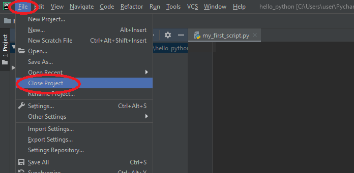
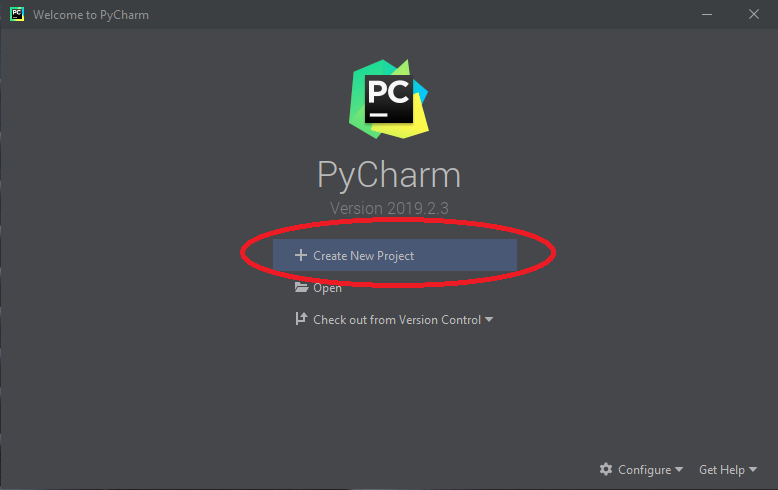
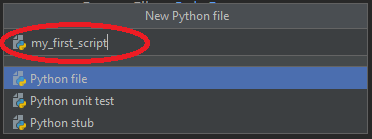
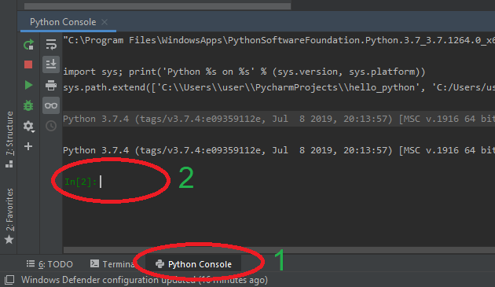

# 08b - Python podstawy

## Czym jest Python?

Python to projekt Open Source interpretowalnego języka programowania wysokiego poziomu. Python posiada rozbudowany wachlarz bibliotek, które pozwalają na wykonanie wielu prostych i skomplikowanych zadań. Czyni to z Pythona, obok języka *R* i *Matlab/GNU Octave*, jedno z najpopularniejszych aktualnie narzędzi do analizy danych. Równocześnie Python świetnie sprawdza się jako rozwiązanie narzędziowe do realizacji szeregu zadań wymaganych w zaawansowanym użytkowaniu komputerów osobistych. Zaletą Pythona jest jego wielo-platformowość,  poprawnie napisany skrypt uruchomimy na systemach Windows, Linux i OS X.

## Tworzenie nowego projektu w PyCharm

Jeżeli w środowisku PyCharm napotkamy po uruchomieniu otwarty projekt należy go zamknąć. Z menu wybieramy **File** &rarr; **Close Project**:



Następnie klikamy **Create New Project**:



W kolejnym oknie nadajemy nazwę projektu oraz jego lokalizację (1). **UWAGA** W nazwie projektu i lokalizacji nie używamy znaków specjalnych (na przykład polskich liter) oraz znaków białych, takich jak spacje (można je zastąpić znakiem podkreślenia: `_` ).

Następnie rozwijamy zakładkę **Project Interpreter:** (2) i wybieramy opcję **Existing interpreter** (3). Zatwierdzamy przyciskiem **Create** (4).


Domyślnie utworzony projekt nie zawiera żadnych plików. Aby dodać nowy plik naciskamy prawym klawiszem myszy na nazwę projektu (1), następnie z menu **New** (2) wybieramy pozycję **Python File** (3) :


Wyskoczy okienko, w którym wpisujemy nazwę dodawanego pliku skryptowego i zatwierdzamy wciskając `ENTER`:



---

#### :hammer: :fire: Zadanie :fire: :hammer:

Utwórz nowy projekt *hello_python* zgodnie z powyższą instrukcją. Dodaj do projektu nowy skrypt: *my_first_script.py*.

---

## Konsola Pythona w PyCharm (*Python Console*)

Python jest językiem skryptowym, interpretowalnym. Dlatego można z niego korzystać wykorzystując interaktywny interpreter konsolowy. PyCharm posiada wbudowane okno konsoli pythona. W celu jego uruchomienia klikamy **Python Console** (1) w lewym dolnym rogu. Po chwili zostanie uruchomiony interpreter Pythona i pojawi się znak zachęty (2).



---

#### :hammer: :fire: Zadanie :fire: :hammer:

Uruchom konsolę python w środowisku programistycznym PyCharm.

---

## Podstawy Pythona

### Podstawowe operacje na liczbach

### Wyświetlanie

### Zmienne

### Listy, ciągi znaków i operacje na nich

## Python w systemowej linii poleceń

Interpreter Pythona można uruchomić także bezpośrednio z systemowej linii poleceń. Uruchomienie terminala linii poleceń różni się zależnie dla systemu. Aby sprawdzić jak uruchomić linię poleceń w systemie Linux Ubuntu i macOS zobacz instrukcję: [08a - Instalacja Python na domowym komputerze](./08a%20-%20Instalacja%20Python%20na%20domowym%20komputerze.md). W systemie Microsoft Windows wciśnij kombinację klawiszy: `Windows + R`. Pojawi się okienko *Uruchamianie*. Wpisz na klawiaturze frazę **cmd** (1), a następnie zatwierdź wciskając `ENTER` lub **OK** (2).


W otwartym terminalu wykonaj następującą komendę:

```shell
python3
```

Uruchomiony zostanie interpreter i pojawi się znak zachęty `>>> _`.

---

#### :hammer: :fire: Zadanie :fire: :hammer:

Wypróbuj część z poznanych, podstawowych funkcji języka Python także w konsoli systemowej.

---

## Skrypty wykonywalne

### Komentarze

## Pętla `for`

## Instrukcja warunkowa `if elif else`

## Operacje na plikach

## Zadanie końcowe :fire: :hammer:

## Zadanie domowe :boom: :house:

---

Autorzy: *Tomasz Mańkowski*
