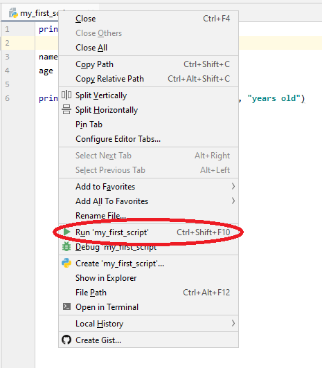
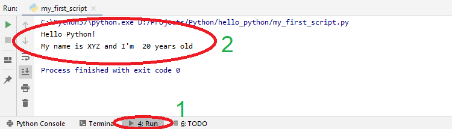
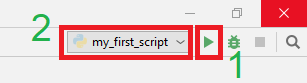
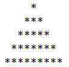
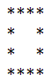

# 08b - Python podstawy

## Czym jest Python?

Python to projekt Open Source interpretowalnego języka programowania wysokiego poziomu. Python posiada rozbudowany wachlarz bibliotek, które pozwalają na wykonanie wielu prostych i skomplikowanych zadań. Czyni to z Pythona, obok języka *R* i *Matlab/GNU Octave*, jedno z najpopularniejszych aktualnie narzędzi do analizy danych. Równocześnie Python świetnie sprawdza się jako rozwiązanie narzędziowe do realizacji szeregu zadań wymaganych w zaawansowanym użytkowaniu komputerów osobistych. Zaletą Pythona jest jego wielo-platformowość,  poprawnie napisany skrypt uruchomimy na systemach Windows, Linux i macOS.

## Tworzenie nowego projektu w PyCharm

Jeżeli w środowisku PyCharm napotkamy po uruchomieniu otwarty projekt należy go zamknąć. Z menu wybieramy **File** &rarr; **Close Project**:


Następnie klikamy **Create New Project**:


W kolejnym oknie nadajemy nazwę projektu oraz jego lokalizację (1). **UWAGA** W nazwie projektu i lokalizacji nie używamy znaków specjalnych (na przykład polskich liter) oraz znaków białych, takich jak spacje (można je zastąpić znakiem podkreślenia: `_` ).

Następnie rozwijamy zakładkę **Project Interpreter:** (2) i wybieramy opcję **Existing interpreter** (3). Zatwierdzamy przyciskiem **Create** (4).


Domyślnie utworzony projekt nie zawiera żadnych plików. Aby dodać nowy plik naciskamy prawym klawiszem myszy na nazwę projektu (1), następnie z menu **New** (2) wybieramy pozycję **Python File** (3) :


Wyskoczy okienko, w którym wpisujemy nazwę dodawanego pliku skryptowego i zatwierdzamy wciskając `ENTER`:


---

#### :hammer: :fire: Zadanie :fire: :hammer:

Utwórz nowy projekt *hello_python* zgodnie z powyższą instrukcją. Dodaj do projektu nowy skrypt: *my_first_script.py*.

---

## Konsola Pythona w PyCharm (*Python Console*)

Python jest językiem skryptowym, interpretowalnym. Dlatego można z niego korzystać wykorzystując interaktywny interpreter konsolowy. PyCharm posiada wbudowane okno konsoli Pythona. W celu jego uruchomienia klikamy **Python Console** (1) w lewym dolnym rogu. Po chwili zostanie uruchomiony interpreter Pythona i pojawi się znak zachęty (2).


---

#### :hammer: :fire: Zadanie :fire: :hammer:

Uruchom konsolę Python w środowisku programistycznym PyCharm.

---

## Podstawy Pythona

### Podstawowe operacje na liczbach

W Pythonie możemy korzystać z podstawowych matematycznych operatorów: `+`, `-`, `*` i `/` przy zachowaniu standardowej kolejności wykonywania działać. Do zmiany kolejności działań wykorzystujemy nawiasy okrągłe `()`:

```python
>>> 3 + 5
8
>>>  9 - 8 * 100
-791
>>> (9 - 8) * 100
100
```

Operacja dzielenia `/` zawsze zwraca wartość zmienno-przecikową, niezależnie od tego czy którakolwiek z liczb jest całkowita:

```python
>>> 100 / 6
16.666666666666668
```

W celu wykonania dzielenia z pominięciem części ułamkowej (podłoga) korzystamy z operatora `//`, reszta z dzielenia może być uzyskana za pomocą operatora modulo `%`:

```python
>>> 100 // 6
16
>>> 100 % 6
4
```

Potęgowanie wykonywane jest z użyciem operatora `**`:

```python
>>> 2 ** 16
65536
```

---

#### :hammer: :fire: Zadanie :fire: :hammer:

1. W uruchomionej konsoli Pythona sprawdź powyższe działania. Zweryfikuj kolejność wykonywania działań.
2. Oblicz jaką kwotę może odliczyć jednoosobowa działalność od podatku dochodowego PIT przy zakupie sprzętu. Kwota brutto zakupu sprzętu wynosi 36 000 zł, co stanowi 123% kwoty netto (wysokość podatku VAT to 23%), wysokość podatku dochodowego PIT to 18%.

---

### Zmienne

W Pythonie istnieje możliwość przypisania wartości do zmiennej. W Pythonie nie ma konieczności wcześniejszej deklaracji zmiennej, ani wcześniejszego przypisywania typu zmiennej. Interpreter sam na podstawie przypisania określi typ. Przypisanie wartości do zmiennej odbywa się za pomocą operatora `=`:

```python
>>> base = 20
>>> height = 3
>>> base * height / 2
30.0
```

Można także zapisać wynik działania do zmiennej:

```python
>>> netto = 100
>>> tax = 1.23
>>> brutto = netto * tax
>>> brutto
123
```

Poza zmiennymi typu `int` czy `float` zmienne mogą przechowywać szereg innych typów wartości. Na przykład ciągi znaków. W Pythonie ciągi znaków mogą zostać zamknięte w pojedynczych `'...'` lub podwójnych `"..."` cudzysłowach. Jeżeli w ciągu znaków chcemy zastosować znak `'` lub `"` (zależnie od użytej formy wprowadzenia ciągu), konieczne będzie użycie znaku ucieczki `\`:

```python
>>> s1 = "Ala ma kota"
>>> s2 = 'Ta Ala tez ma kota`
>>> s2 = "Ala powiedziala: \"To nie moj kot\""
>>> s3 = 'Don\'t say that Ala!'
```

Istnieje możliwość łączenia ciągów znaków za pomocą operatora `+`:

```python
>>> prefix = "http://www."
>>> domain = "google.com"
>>> prefix + domain
'http://www.google.com'
```

---

#### :hammer: :fire: Zadanie :fire: :hammer:

1. Korzystając z konsoli i zmiennych wprowadź dwie przyprostokątne trójkąta. Oblicz pole i zapisz do zmiennej.
2. Oblicz przeciwprostokątną i zapisz do zmiennej. **PODPOWIEDŹ** Pamiętaj, że pierwiastek kwadratowy z liczby, to to samo co podniesienie tej liczby do potęgi 0.5.
3. Na podstawie powyższego wyniku zapisanego do zmiennej oblicz obwód trójkąta.

---

### Wyświetlanie

Jak widzisz, przy wykorzystaniu konsoli Python sam wypisuje wynik ostatniej operacji. Jeżeli chcemy wyświetlić napis na które składa się parę wartości konieczne jest wykorzystanie funkcji `print()`. Podając jako kolejne argumenty zmienne lub wartości wyświetlony zostanie złożony ciąg znaków.

```python
>>> print('Hello!')
Hello!
>>> name = 'Jan'
>>> age = 21
>>> height = 1.80
>>> print('This is', name, ', he is', age, 'years old and measures', height, 'm')
This is Jan , he is 21 years old and measures 1.8 m
```

### Listy i operacje na nich

W Pythonie domyślą formą przechowywania grupy wartości jest lista (`list`). Listę wypełniamy wpisując kolejne wartości po przecinkach i umieszczając je w nawiasach kwadratowych:

```python
>>> primes = [2, 3, 5, 7, 11, 13, 17, 19, 23, 29, 31, 37]
```

Do elementów listy możemy odwoływać się wykorzystując operator `[]`. Możliwy jest dostęp do pojedynczego elementu (lista indeksowana jest od 0), lub do jego zakresu :

```python
>>> primes[0]
2
>>> primes[-1]  # ostatni element
37
>>> primes[1:4] # zakres prawostronnie otwarty
[3, 5, 7]
>>> primes[3:]  # od indeksu początkowego do końca
[7, 11, 13, 17, 19, 23, 29, 31, 37]
>>> primes[::2] # co drugi element z listy
[2, 5, 11, 17, 23, 31]
```

Listy można sklejać za pomocą operatora `+`:

```python
>>> primes + [41, 43, 47, 53, 59, 61, 67]
[2, 3, 5, 7, 11, 13, 17, 19, 23, 29, 31, 37, 41, 43, 47, 53, 59, 61, 67]
```

Istnieje możliwość zmiany zawartości listy:

```python
>>> my_list = [1, 2, 3]
>>> my_list[0] = 3
>>> my_list
[3, 2, 3]
```

A także dodania kolejnego elementu z wykorzytaniem metody `append()`:

```python
>>> my_list.append(2)
>>> my_list
[3, 2, 3, 2]
```

Pojedyncza lista może zawierać wpisy różnego typu, także drugą listę:

```python
>>> mixed_type_list = [1, "string", 0.43, [1, 2, 3, 4], ['a', 1, 'g']]
```

Bardzo przydatną funkcją jest `len()` pozwalającą na określenie długości listy, a także każdego innego obiektu w Python:

```python
>>> len(primes)
12
>>> len(my_list)
4
>>> len(mixed_type_list)
5
>>> len(mixed_type_list[4])
3
```

---

#### :hammer: :fire: Zadanie :fire: :hammer:

1. Korzystając z konsoli utwórz listę liczb naturalnych od 0 do 12 włącznie i przypisz ją do zmiennej.
2. Utwórz drugą listę, która zawierać będzie wewnątrz dwie listy: listę liczb parzystych i nieparzystych. **UWAGA** Do utworzenia obu list wykorzystaj istniejącą już listę liczb naturalnych i operator `[]`.
3. Utwórz trzecią listę, która zawierać będzie długości obu list zawartych w liście drugiej.

---

## Python w systemowej linii poleceń

Interpreter Pythona można uruchomić także bezpośrednio z systemowej linii poleceń. Uruchomienie terminala linii poleceń różni się zależnie dla systemu. Aby sprawdzić jak uruchomić linię poleceń w systemie Linux Ubuntu i macOS zobacz instrukcję: [08a - Instalacja Python na domowym komputerze](./08a%20-%20Instalacja%20Python%20na%20domowym%20komputerze.md). W systemie Microsoft Windows wciśnij kombinację klawiszy: `Windows + R`. Pojawi się okienko *Uruchamianie*. Wpisz na klawiaturze frazę **cmd** (1), a następnie zatwierdź wciskając `ENTER` lub **OK** (2).


W otwartym terminalu wykonaj następującą komendę:

```shell
python3
```

Uruchomiony zostanie interpreter i pojawi się znak zachęty `>>> _`.

---

#### :hammer: :fire: Zadanie :fire: :hammer:

Wypróbuj część z poznanych, podstawowych funkcji języka Python także w konsoli systemowej.

---

## Skrypty wykonywalne

Kiedy chcemy stworzyć użytkowy kod wskazane jest, aby do nie wykorzystywać do konsoli, lecz zapisać nasz kod w pliku, który wykonamy w całości, a nie jak dotychczas wpisując pojedyncze komendy. W przypadku Pythona pliki skryptowe posiadają rozszerzenie `.py`. W początkowej części zajęć utworzyliśmy nasz pierwszy skrypt o nazwie *my_first_script.py*.

---

#### :hammer: :fire: Zadanie :fire: :hammer:

W skrypcie *my_first_script.py* wklej przykładowy poniższy kod:

```python
print("Hello Python!")

name = 'XYZ'
age = 20

print("My name is", name, "and I'm ", age, "years old")
```

---

W celu pierwszego wykonania skryptu klikamy prawym klawiszem myszy na zakładce z nazwą skryptu i wybieramy **Run '*nazwa_skryptu*'**, lub wciskamy kombinację klawiszy `Ctrl + Shift + F10`:



W dolnej części okna PyCharm wyświetlona zostanie zakładka **Run** (1), a w konsoli pojawi się wynik wykonywania naszego skryptu (2):



Każde kolejne wykonanie skryptu od tego momentu może zostać wywołanie przez wciśnięcie przycisku **Play** (1) w prawym górnym rogu lub wciskając kombinację klawiszy `Shift + F10`. Jeżeli w projekcie wywołaliśmy wykonanie więcej niż jednego skryptu, aktualnie wykonywany skrypt możemy wybrać z rozwijanej listy (2):



---

#### :hammer: :fire: Zadanie :fire: :hammer:

1. Wykonaj skrypt *my_first_script.py* według powyższej instrukcji.
2. Wprowadź drobne zmiany do skryptu i wykonaj go ponownie.

---

### Komentarze

Tekst umieszczany po znaku `#` jest ignorowany przez interpreter Pythona. Za znakiem `#` można umieszczać komentarze do kodu. Komentarz może pojawić się na początku linii lub po linii która ma zostać wykonania. Komentarz może zostać wykorzystany do dezaktywacji fragmentu kodu:

```python
# to jest komentarz na początku linii
x = 5 # a to komentrz opisujący przypisanie wartości 5 do zmiennej x

# a poniższy komentarz dezaktywuje linię kodu
# print('Bye Python!')
```

## Pętla `for`

W Python pętla `for` służy do przechodzenia po wszystkich elementach zadanego zbioru. Zbiorem może być dowolna zdefiniowana sekwencja, na przykład lista, albo ciąg znaków. Na przykład:

```python
students = ['Marek', 'Alicja', 'Franciszek', 'Karolina']
for s in students:
    print(s, len(s))

print() # wypisuje pustą linię

for character in students[1]:
    print(character)
    print("ASCII:", ord(character)) # funkcja ord() zwraca kod ASCII znaku
```

> Marek 5  
> Alicja 6  
> Franciszek 10  
> Karolina 8  
>  
> A  
> ASCII: 65  
> l  
> ASCII: 108  
> i  
> ASCII: 105  
> c  
> ASCII: 99  
> j  
> ASCII: 106  
> a  
> ASCII: 97

Zwróć uwagę na sposób definiowania *ciała* wyrażenia `for`. Wszystkie komendy, które mają zostać powtórzone w ramach pętli zostały *wcięte*. Wcięcie wykonujemy poprzez wciśnięcie klawisza **TAB** na klawiaturze. Komenda, która ma zostać umieszczona poza pętlą pojawia się już bez wcięcia (patrz linia `print() # wypisuje pustą linię`). Opisywany sposób grupowania komend dotyczy wszystkich form stosowanych w Python, instrukcji warunkowych czy funkcji. Istnieje możliwość zagnieżdżonego grupowania i umieszczenia pętli w pętli poprzez wykonywanie kolejnych wcięć:

```python
students = ['Marek', 'Alicja', 'Franciszek', 'Karolina']
for s in students:
    for character in students[1]:
        print(character)
        print("ASCII:", ord(character))

    print()  # wypisuje pustą linię
```

### Funkcja `range()`

Kiedy zaistnieje konieczność przejścia pętlą przez sekwencje liczb można wykorzystać do tego celu funkcję `range()`, która generuje ciąg arytmetyczny:

```python
for n in range(10):   # generuje zakres od 0 do 9 (przedział prawostronnie otwarty)
    print(n, end=" ") # end=" " zamienia znak końca linii na spację
```

> 0 1 2 3 4 5 6 7 8 9

```python
for n in range(2, 11): # generuje zakres od 2 do 10
    print(n, end=" ")
```

> 2 3 4 5 6 7 8 9 10

```python
for n in range(-10, 100, 10): # generuje zakres od -10 do 90, z krokiem 10
    print(n, end=" ")
```

> -10 0 10 20 30 40 50 60 70 80 90

Funkcję `range()` możemy wykorzystać na przykład do indeksowania sekwencji:

```python
animals = ['Dog', 'Cat', 'Monkey', 'Tiger', 'Parrot']
for anmimal_index in range(len(animals)):
    animals[anmimal_index] = str(anmimal_index) + ". " + animals[anmimal_index]
    # animal_index jest liczbą całkowitą, w celu zamiany na ciąg znaków korzystamy z str()

print(animals)
```

> ['0. Dog', '1. Cat', '2. Monkey', '3. Tiger', '4. Parrot']

---

#### :hammer: :fire: Zadanie :fire: :hammer:

1. Napisz skrypt w którym utworzysz listę liczb o dowolnej długości, lista powinna zawierać różne, dowolne wartości.
2. Napisz pętlę, która wyświetli potęgę każdej z podanych licz.
3. Dodaj do skryptu dwie zmienne, które będą określać przedział listy dla której będzie wykonana operacja. Napisz drugą pętlę która będzie wyświetlać wynik sześcianu liczb z podanego zakresu. **PODPOWIEDŹ** Wykorzystaj funkcję `range()`.

---

## Instrukcja warunkowa `if elif else`

Instrukcje warunkowe pozwalają na wykonywanie części kodu, jeżeli został spełniony zadany warunek. W przypadku Python przykładowe wykorzystanie konstrukcji `if` wygląda następująco:

```python
if x < 0:
    print('Negative value')
elif x == 0:
    print('Zero')
elif x == 1:
    print('One')
else:
    print('More than one')
```

Jak widać w powyższym przykładzie przypisanie instrukcji do wykonania po spełnieniu warunku wykonywane jest przez zastosowanie *wcięć*. Podstawowa forma instrukcji warunkowej może zawierać tylko `if`, `elif` i `else` nie są konieczne. Jeżeli warunek `if` nie zostanie spełniony sprawdzane są kolejne warunki zawarte w `elif`, na końcu jeżeli żaden warunek nie został spełniony program może wykonać instrukcje zawarte w sekcji `else`.

---

#### :hammer: :fire: Zadanie :fire: :hammer:

1. Napisz skrypt w którym utworzysz listę imion swoich kolegów z szkolnej ławki, około 10.
2. Napisz program który wypisze tylko te imiona których długość jest większa niż 5. **PODPOWIEDŹ** Skorzystaj z pętli `for` i zagnieżdżonej w niej instrukcji warunkowej.

---

## Zadanie końcowe :fire: :hammer:

1. Twoja ulubiona lokalna pizzeria sprzedaje 4 rozmiary pizzy *Pepperoni* w cenach podanych w tabeli poniżej. Umieść rozmiary pizzy w jednaj liście, a odpowiadające im ceny w drugiej liście. Napisz skrypt, który wybierze najbardziej opłacalną pizzę. **PODPOWIEDŹ** w pętli `for` wykorzystaj funkcję `range()` do indeksowania sekwencji.

|Średnica|Cena|
|-|-|
|24 cm|22,60 zł|
|32 cm|32,60 zł|
|42 cm|38,70 zł|
|51 cm|46,30 zł|

2. Na kolejkę górską wpuszczane są jedynie dzieci o wzroście większym niż 120 cm. W liście *names* umieść imiona dzieci, a w liście *heights* ich wzrost. Napisz skrypt który wypisze tekstową informację zapraszającą dzieci do wsiadania, "XYZ! You are xxx cm in height, come in!". Przykładowe dane i wynik skryptu:

|Imię|Wzrost [cm]|
|-|-|
|Anna|80|
|Jan|122|
|Marcin|140|
|Karolina|101|
|Zofia|132|
|Dariusz|120|
|Joanna|115|

> Jan! You are 122 cm in height, come in!  
> Marcin! You are 140 cm in height, come in!  
> Zofia! You are 132 cm in height, come in!  

## Zadanie domowe :boom: :house:

#### Zadanie 1

Napisz skrypt rysujący w konsoli choinkę o zadanej wysokości. Przykładowo dla `height = 5`:



#### Zadanie 2

Napisz skrypt rysujący w konsoli pusty kwadrat o zadanej długości boku. Przykładowo dla `side = 4`:



#### Zadanie 3

Dany jest tekst:

> Lorem ipsum dolor sit amet, consectetur adipiscing elit. Suspendisse facilisis feugiat malesuada. Cras iaculis iaculis lacus quis tempus. Quisque viverra erat sit amet odio condimentum venenatis. Aliquam accumsan porta massa. Nam fermentum gravida fringilla. Morbi ut ornare metus, id congue erat. Vestibulum in est nec dolor malesuada vulputate vitae non ligula. Sed ut elit in libero hendrerit ultricies varius suscipit diam.

Napisz skrypt który w powyższym tekście zliczy liczbę wyrazów, znajdzie w którym miejscu w ciągu występuje słowo "congue", zliczy występowanie litery 'a' w tekście. **PODPOWIEDŹ** Każdy z wymienionych zadań jesteś w stanie wykonać sam, *ręcznie*, lecz spróbuj wyszukać w Internecie łatwiejsze rozwiązanie!

---

Autorzy: *Tomasz Mańkowski*, *Jakub Tomczyński*
