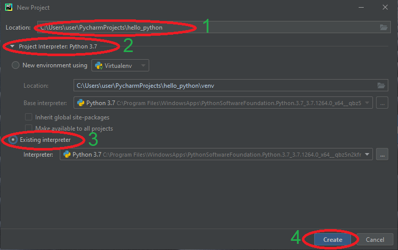
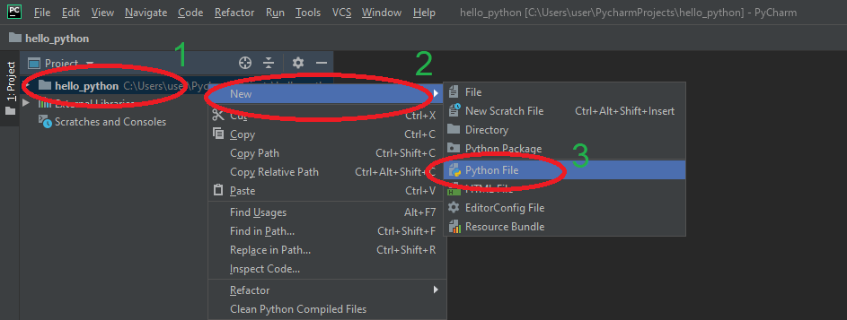

# 08b - Python podstawy

## Czym jest Python?

Python to projekt Open Source interpretowalnego języka programowania wysokiego poziomu. Python posiada rozbudowany wachlarz bibliotek, które pozwalają na wykonanie wielu prostych i skomplikowanych zadań. Czyni to z Pythona, obok języka *R* i *Matlab/GNU Octave*, jedno z najpopularniejszych aktualnie narzędzi do analizy danych. Równocześnie Python świetnie sprawdza się jako rozwiązanie narzędziowe do realizacji szeregu zadań wymaganych w zaawansowanym użytkowaniu komputerów osobistych. Zaletą Pythona jest jego wielo-platformowość,  poprawnie napisany skrypt uruchomimy na systemach Windows, Linux i macOS.

## Tworzenie nowego projektu w PyCharm

Jeżeli w środowisku PyCharm napotkamy po uruchomieniu otwarty projekt należy go zamknąć. Z menu wybieramy **File** &rarr; **Close Project**:


Następnie klikamy **Create New Project**:


W kolejnym oknie nadajemy nazwę projektu oraz jego lokalizację (1). **UWAGA** W nazwie projektu i lokalizacji nie używamy znaków specjalnych (na przykład polskich liter) oraz znaków białych, takich jak spacje (można je zastąpić znakiem podkreślenia: `_` ).

Następnie rozwijamy zakładkę **Project Interpreter:** (2) i wybieramy opcję **Existing interpreter** (3). Zatwierdzamy przyciskiem **Create** (4).



Domyślnie utworzony projekt nie zawiera żadnych plików. Aby dodać nowy plik naciskamy prawym klawiszem myszy na nazwę projektu (1), następnie z menu **New** (2) wybieramy pozycję **Python File** (3) :



Wyskoczy okienko, w którym wpisujemy nazwę dodawanego pliku skryptowego i zatwierdzamy wciskając `ENTER`:


---

#### :hammer: :fire: Zadanie :fire: :hammer:

Utwórz nowy projekt *hello_python* zgodnie z powyższą instrukcją. Dodaj do projektu nowy skrypt: *my_first_script.py*.

---

## Konsola Pythona w PyCharm (*Python Console*)

Python jest językiem skryptowym, interpretowalnym. Dlatego można z niego korzystać wykorzystując interaktywny interpreter konsolowy. PyCharm posiada wbudowane okno konsoli Pythona. W celu jego uruchomienia klikamy **Python Console** (1) w lewym dolnym rogu. Po chwili zostanie uruchomiony interpreter Pythona i pojawi się znak zachęty (2).


---

#### :hammer: :fire: Zadanie :fire: :hammer:

Uruchom konsolę Python w środowisku programistycznym PyCharm.

---

## Podstawy Pythona

### Podstawowe operacje na liczbach

W Pythonie możemy korzystać z podstawowych matematycznych operatorów: `+`, `-`, `*` i `/` przy zachowaniu standardowej kolejności wykonywania działać. Do zmiany kolejności działań wykorzystujemy nawiasy okrągłe `()`:

```python
>>> 3 + 5
8
>>>  9 - 8 * 100
-791
>>> (9 - 8) * 100
100
```

Operacja dzielenia `/` zawsze zwraca wartość zmienno-przecikową, niezależnie od tego czy którakolwiek z liczb jest całkowita:

```python
>>> 100 / 6
16.666666666666668
```

W celu wykonania dzielenia z pominięciem części ułamkowej (podłoga) korzystamy z operatora `//`, reszta z dzielenia może być uzyskana za pomocą operatora modulo `%`:

```python
>>> 100 // 6
16
>>> 100 % 6
4
```

Potęgowanie wykonywane jest z użyciem operatora `**`:

```python
>>> 2 ** 16
65536
```

---

#### :hammer: :fire: Zadanie :fire: :hammer:

1. W uruchomionej konsoli Pythona sprawdź powyższe działania. Zweryfikuj kolejność wykonywania działań.
2. Oblicz jaką kwotę może odliczyć jednoosobowa działalność od podatku dochodowego PIT przy zakupie sprzętu. Kwota brutto zakupu sprzętu wynosi 36 000 zł, co stanowi 123% kwoty netto (wysokość podatku VAT to 23%), wysokość podatku dochodowego PIT to 18%.

---

### Zmienne

W Pythonie istnieje możliwość przypisania wartości do zmiennej. W Pythonie nie ma konieczności wcześniejszej deklaracji zmiennej, ani wcześniejszego przypisywania typu zmiennej. Interpreter sam na podstawie przypisania określi typ. Przypisanie wartości do zmiennej odbywa się za pomocą operatora `=`:

```python
>>> base = 20
>>> height = 3
>>> base * height / 2
30.0
```

Można także zapisać wynik działania do zmiennej:

```python
>>> netto = 100
>>> tax = 1.23
>>> brutto = netto * tax
>>> brutto
123
```

Poza zmiennymi typu `int` czy `float` zmienne mogą przechowywać szereg innych typów wartości. Na przykład ciągi znaków. W Pythonie ciągi znaków mogą zostać zamknięte w pojedynczych `'...'` lub podwójnych `"..."` cudzysłowach. Jeżeli w ciągu znaków chcemy zastosować znak `'` lub `"` (zależnie od użytej formy wprowadzenia ciągu), konieczne będzie użycie znaku ucieczki `\`:

```python
>>> s1 = "Ala ma kota"
>>> s2 = 'Ta Ala tez ma kota`
>>> s2 = "Ala powiedziala: \"To nie moj kot\""
>>> s3 = 'Don\'t say that Ala!'
```

Istnieje możliwość łączenia ciągów znaków za pomocą operatora `+`:

```python
>>> prefix = "http://www."
>>> domain = "google.com"
>>> prefix + domain
'http://www.google.com'
```

---

#### :hammer: :fire: Zadanie :fire: :hammer:

1. Korzystając z konsoli i zmiennych wprowadź dwie przyprostokątne trójkąta. Oblicz pole i zapisz do zmiennej.
2. Oblicz przeciwprostokątną i zapisz do zmiennej. **PODPOWIEDŹ** Pamiętaj, że pierwiastek kwadratowy z liczby, to to samo co podniesienie tej liczby do potęgi 0.5.
3. Na podstawie powyższego wyniku zapisanego do zmiennej oblicz obwód trójkąta.

---

### Wyświetlanie

Jak widzisz, przy wykorzystaniu konsoli Python sam wypisuje wynik ostatniej operacji. Jeżeli chcemy wyświetlić napis na które składa się parę wartości konieczne jest wykorzystanie funkcji `print()`. Podając jako kolejne argumenty zmienne lub wartości wyświetlony zostanie złożony ciąg znaków.

```python
>>> print('Hello!')
Hello!
>>> name = 'Jan'
>>> age = 21
>>> height = 1.80
>>> print('This is', name, ', he is', age, 'years old and measures', height, 'm')
This is Jan , he is 21 years old and measures 1.8 m
```

### Listy i operacje na nich

W Pythonie domyślą formą przechowywania grupy wartości jest lista (`list`). Listę wypełniamy wpisując kolejne wartości po przecinkach i umieszczając je w nawiasach kwadratowych:

```python
>>> primes = [2, 3, 5, 7, 11, 13, 17, 19, 23, 29, 31, 37]
```

Do elementów listy możemy odwoływać się wykorzystując operator `[]`. Możliwy jest dostęp do pojedynczego elementu (lista indeksowana jest od 0), lub do jego zakresu :

```python
>>> primes[0]
2
>>> primes[-1]  # ostatni element
37
>>> primes[1:4] # zakres prawostronnie otwarty
[3, 5, 7]
>>> primes[3:]  # od indeksu początkowego do końca
[7, 11, 13, 17, 19, 23, 29, 31, 37]
```

Listy można sklejać za pomocą operatora `+`:

```python
>>> primes + [41, 43, 47, 53, 59, 61, 67]
[2, 3, 5, 7, 11, 13, 17, 19, 23, 29, 31, 37, 41, 43, 47, 53, 59, 61, 67]
```

Istnieje możliwość zmiany zawartości listy:

```python
>>> my_list = [1, 2, 3]
>>> my_list[0] = 3
>>> my_list
[3, 2, 3]
```

A także dodania kolejnego elementu z wykorzytaniem metody `append()`:

```python
>>> my_list.append(2)
>>> my_list
[3, 2, 3, 2]
```

Pojedyncza lista może zawierać wpisy różnego typu, także drugą listę:

```python
>>> mixed_type_list = [1, "string", 0.43, [1, 2, 3, 4], ['a', 1, 'g']]
```

Bardzo przydatną funkcją jest `len()` pozwalającą na określenie długości listy, a także każdego innego obiektu w Python:

```python
>>> len(primes)
12
>>> len(my_list)
4
>>> len(mixed_type_list)
5
>>> len(mixed_type_list[4])
3
```

---

#### :hammer: :fire: Zadanie :fire: :hammer:

1. TODO

---

## Python w systemowej linii poleceń

Interpreter Pythona można uruchomić także bezpośrednio z systemowej linii poleceń. Uruchomienie terminala linii poleceń różni się zależnie dla systemu. Aby sprawdzić jak uruchomić linię poleceń w systemie Linux Ubuntu i macOS zobacz instrukcję: [08a - Instalacja Python na domowym komputerze](./08a%20-%20Instalacja%20Python%20na%20domowym%20komputerze.md). W systemie Microsoft Windows wciśnij kombinację klawiszy: `Windows + R`. Pojawi się okienko *Uruchamianie*. Wpisz na klawiaturze frazę **cmd** (1), a następnie zatwierdź wciskając `ENTER` lub **OK** (2).


W otwartym terminalu wykonaj następującą komendę:

```shell
python3
```

Uruchomiony zostanie interpreter i pojawi się znak zachęty `>>> _`.

---

#### :hammer: :fire: Zadanie :fire: :hammer:

Wypróbuj część z poznanych, podstawowych funkcji języka Python także w konsoli systemowej.

---

## Skrypty wykonywalne

### Komentarze

## Pętla `for`

## Instrukcja warunkowa `if elif else`

## Operacje na plikach

## Zadanie końcowe :fire: :hammer:

## Zadanie domowe :boom: :house:

---

Autorzy: *Tomasz Mańkowski*
